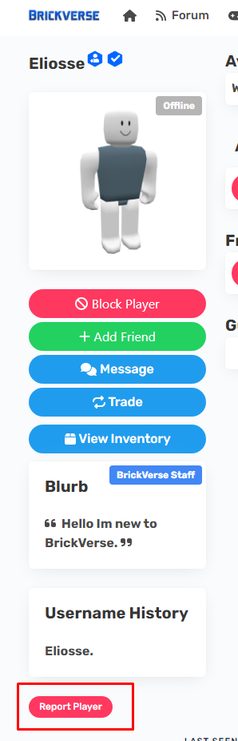

# UGC Creator Nameplate

## About

The UGC Creator Nameplate appears above the Creator of the Marketplace Item/Developer Asset. This is added so users understand this is the creator of the item.

## How do I get it?

It's automatic.

## Preview

<figure><figcaption></figcaption></figure>
