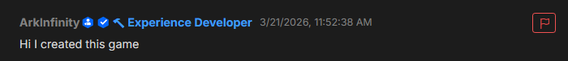

# How to Report Rule Violations

## Introduction

BrickVerse is a vibrant and inclusive community that welcomes players and developers of all ages. We strive to create a safe and enjoyable environment where everyone can freely express their creativity and engage in positive interactions. We understand the importance of upholding community guidelines and ensuring that everyone feels comfortable and respected.

In order to maintain a high standard of conduct, we have implemented robust tools and systems to address any instances of rule-breaking or inappropriate behavior. If you come across any user who is violating our community guidelines, we encourage you to report them. By reporting such incidents, you play an active role in helping us enforce the rules and create a safer community for everyone.

When it comes to reporting users, we provide convenient options both in-game and on our website. In the game, you can utilize the built-in reporting feature, usually accessible through the settings or player menu. This allows you to quickly and efficiently report any incidents or individuals that you believe are engaging in inappropriate behavior. Our dedicated moderation team will review each report thoroughly and take appropriate action to address the situation.

Similarly, on our website, we have a user-friendly reporting system in place. You can navigate to the designated reporting section and provide details about the incident or user in question. We highly encourage you to provide as much information as possible, including screenshots or any supporting evidence, to help us better understand the situation. Rest assured that all reports are treated confidentially and handled with utmost professionalism.

By actively reporting users who violate our community guidelines, you contribute to the well-being of BrickVerse and help us maintain a positive and enjoyable environment for all. We value your partnership in creating a safe and fun community and appreciate your commitment to upholding our standards.

Together, let's build a thriving and respectful community within BrickVerse where everyone can flourish and make lasting memories.

## Reporting a Profile

In order to report a player you must navigate to their profile and select the red Report button shown below.

<figure><figcaption></figcaption></figure>
